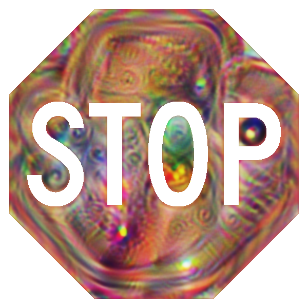

**PASS** is a command line interface tool with attack pipeline that loads the test scenario in [CARLA](https://carla.org/) simulator. For proof of concept, it contains a naive autonomous driving agent which controls the ego vehicle (car under test) during the simulation. It also supports integration with [Apollo](https://developer.apollo.auto/index.html).

This was a group project with 4 members under [Prof. Alfred Chen](https://www.ics.uci.edu/~alfchen/).
The project will be highlighted at [UCI MCS Capstone Projects Showcase 2023](https://mcs.ics.uci.edu/capstone-2023/). 

[Have a look!!](https://mcs.ics.uci.edu/capstone_project/pass-platform-for-autonomous-driving-security-and-safety/)

## Attack Description
Based on the [Shape Shifter](https://arxiv.org/abs/1804.05810) attack, we used the stop sign image to confuse the Faster R-CNN object detection algorithm.

## Defense Description

We built the defense pipeline in which the ego vehicle uses the Faster R-CNN algorithm to detect the objects. Based on the current position, speed, and safe deceleration we calculate the minimum distance required to stop the vehicle. If the stop sign is detected within this distance, then the vehicle stops as it approaches the stop sign.

## My contributions to the project

1. Created a customized CARLA simulator by modifying Stop Sign Unreal Engine uasset. This was done to add texture on the stop sign using CARLA's PythonAPI. By default, CARLA's API cannot edit the stop sign element.
2. Added API for the attack pipeline where the desired stop sign image was applied to the stop sign in the simulation.  
3. Implemented the defense pipeline for the attack using:
    - Faster R-CNN model as the object detection algorithm.
    - Camera Pinhole Model and HDMap to calculate the vehicle distance from stop sign.
4. Adjusted the parameters of [PID controller](https://github.com/m-lundberg/simple-pid) to support control speed of 10 mph, 15 mph, 20 mph, and 25 mph.

## Observations

1. The attack was successful (the ego vehicle could not detect the stop sign) in 10 out of 15 weather conditions for all speeds.
2. Apollo does not use camera-based logic for stop sign detection. It uses HDMap location information, hence the attack was never successful.

## Video Outputs

During simulation, PASS saves the video which are the images taken by the ego vehicle camera and are modified in the defense pipeline with the bounding boxes detected by the Faster R-CNN model.

#### Unmodified Stop Sign 

  <iframe src="https://www.youtube.com/embed/vX0IF9A4LFM" 
          title="Unmodified Stop Sign" 
          allowfullscreen>
  </iframe>

#### Shape Shifted Stop Sign - Successful Attack

  <iframe src="https://www.youtube.com/embed/3v5yPcTPRXA" 
          title="Shape Shifted Stop Sign" 
          allowfullscreen>
  </iframe>

#### Unmodified Stop Sign with heavy rain

  <iframe src="https://www.youtube.com/embed/aOBv5vcB5JQ" 
          title="Unmodified Stop Sign with rain" 
          allowfullscreen>
  </iframe>

#### Shape Shifted Stop Sign with rain - Successful Attack

  <iframe src="https://www.youtube.com/embed/iZxnEp-wr20" 
          title="Unmodified Stop Sign with rain" 
          allowfullscreen>
  </iframe>

#### Shape Shifted Stop Sign - Failed Attack

  <iframe src="https://www.youtube.com/embed/0yFZj8WMohI" 
          title="Unmodified Stop Sign with rain" 
          allowfullscreen>
  </iframe>

