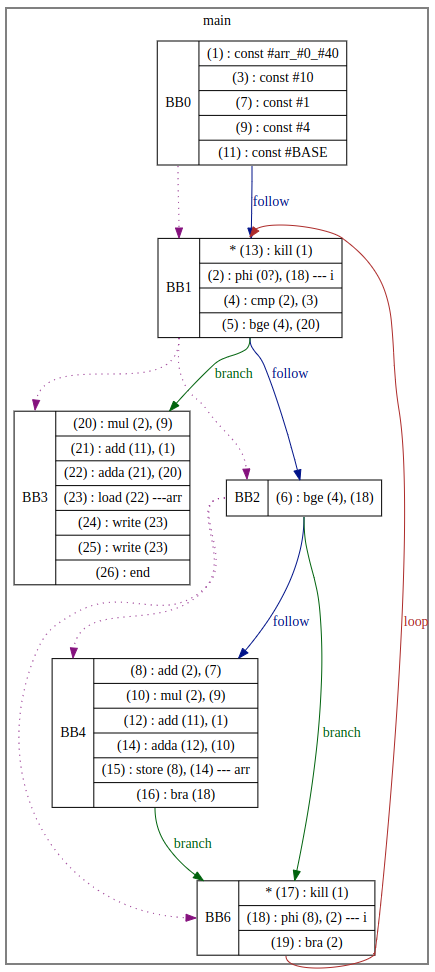

## About SMPL

[SMPL](https://github.com/pallavi-garg/smpl-opt-compiler/blob/master/grammars/smpl_grammar.txt) is a small programming language used in academia and can be parsed using an LL(1) parser. It consists of integers, if-else statement, while loop, arrays (single and multidimensional), and functions (user- and pre-defined).

## Aim

The aim of this project is to implement an optimizing compiler of SMPL language from scratch.

The compiler generates an [SSA-based IR](https://en.wikipedia.org/wiki/Static_single-assignment_form), and performs optimizations such as copy propagation, common subexpression elimination, removal of redundant load and store operations in first pass. As as second pass, dead code elimination should be done to reduce the size of IR.

## Development Process

The implementation was divided into multiple steps as described below:

#### Generating SSA-based IR
The first step involved generating SSA-based IR of the given input program while leaving out while loop, arrays and functions. Optimizations such as copy propagation and common subexpression elimination are performed on the fly while generating the IR.

 - For this, I first built a recursive-descent parser for a subset of the language.
 - While parsing, the copy propagation and common subexpression elimination optimizations are applied on the fly. 
 - To achieve this, I built a dominator tree during parsing and before converting any statement into its equivalent instruction, I first check if:
    - common subexpression elimination optimization can be performed using a *search data structure*
    - copy propagation optimization can be applied
  - Based on above decisions, instruction is generated and added into the basic block and search data structure.
  - The basic blocks are maintained in memory in a *control flow graph (CFG) structure*.

#### Output Visualization
The output of the previous step is visualized using [Graphviz](http://www.webgraphviz.com/). For this step, I simply walk the CFG and transpile it into DOT language for visualization.

#### Supporting While loop and Arrays

1. Next the compiler was extended to support while loops. Here, the major challenge was to perform common sub-expression elimination for **phi instructions** once the whole loop was finished.
2. Later on, I included array load and store operations. These operations also undergo common subexpression elimination to eliminate any redundant loads. One important point here is to include **kill instructions** every time a store is performed. This is important as it ensures that the correct value is used every time an array element is accessed.
3. Also in case of a store instruction is added inside a while loop, then there could be cases to add a kill statement in the join block of loop. This is done to load the updated array values.

#### User-defined Functions
After adding array operations, I added support for user-defined functions with following assumptions:

 1. Arrays cannot be passed to the functions
 2. Functions can only return a scalar
 3. Global variables are not accessible from within the functions
 4. Variable names are unique, i.e. there are no conflicting names between global and local variables


#### Example

Below is just one example. Please checkout [this](https://github.com/pallavi-garg/smpl-opt-compiler#some-examples) for more examples.

SMPL Code

```
 main 
 var i; 
 array[10] arr; 
 {
     while i < 10 do 
         if i < 10 then
             let arr[i] <- i + 1; 
             let i <-i + 1 
         fi;
     od; 
     call OutputNum(arr[i]);
     call OutputNum(arr[i])
 }.
```

Generated IR (Visualized in Graphviz)

 

Source Code: <a href="https://github.com/pallavi-garg/smpl-opt-compiler">SSA Based Optimized Compiler for SMPL</a>
