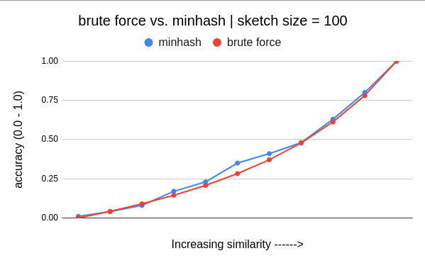
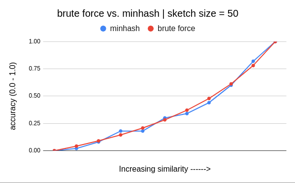
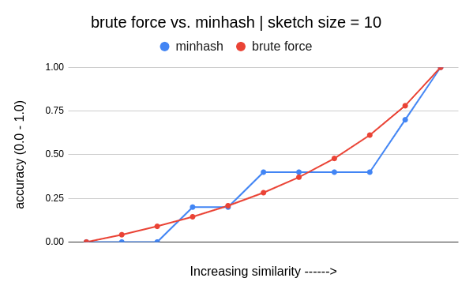
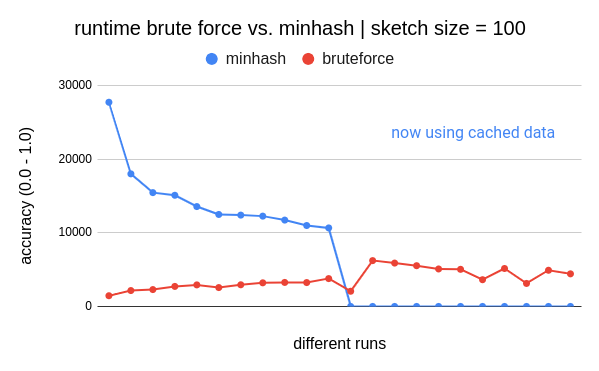

### Problem Statement
Given two documents, find the similarity between them. The problem does not involve extracting any semantic meaning of the documents but simply looking at whether they contain the same words.

### Solution Approach | Viewing Documents as Sets
When documents are represented as sets of words, the Jaccard Similarity is employed to gauge the extent of overlap between them. However, this approach may not yield optimal results when comparing documents that share similar concepts but are otherwise entirely distinct. It is more effective in scenarios where there is an anticipation of substantial word similarity between the documents, such as plagiarism detection among news articles from the same source or identifying similar choices based on a movie watch list.

#### Jaccard Similarity
The Jaccard Similarity Coefficient is a measure that determines the similarity between two finite sets. It is calculated by dividing the size of their intersection by the size of their union. This coefficient provides an intuitive way to quantify similarity, and its value ranges between 0 and 1. When the two sets are completely distinct (disjoint), the coefficient is 0, indicating no similarity. On the other hand, if the sets are identical, the coefficient is 1, indicating complete similarity. 

```

J(set1 , set2) = Intersecton(set1, set2) / Union(set1, set2)

```
When dealing with large volumes of data, such as comparing articles across millions of documents, directly calculating the raw Jaccard Similarity for all document pairs becomes prohibitively time-consuming. However, by leveraging the MinHash technique, we can approximate the Jaccard Similarity and achieve a significant speedup. MinHash allows us to create concise document signatures and estimate similarity efficiently, making it practical to process vast amounts of data within a reasonable timeframe. 

#### Minhash Algorithm
MinHash is a fast approximation algorithm for the Jaccard Similarity Coefficient. Rather than repeatedly computing unions and intersections, it creates MinHash Signatures for each set. These signatures are used to estimate the coefficient, providing an efficient approach without the need for extensive set operations.

### Solution

##### Shingling
At first, I parse the document into set of shingles (a string of 8 consecutive characters) from the document. For example, if document has "A rose is a rose.", then shingles are "A rose i", " rose is", "rose is ", and so on. Later these shingles are hashed into integers.

#### Minhash Signatures | Fingerprinting
Now I create a sketch vector of length equal to the number of hash functions to use. In my code I have used 100 for this. So the sketch vector size is 200. The higher this number is, higher accuracy will be achieved. Using the hash function, each shingle is converted into integer representation. The minimum of the hash values (for all shingles) per hash function is saved as the signature of the document for that hash function in the sketch vector. Let's say we have h1, h2 as two hash functions, and set s1 has t1, t2, t3 shigles in it. Sketch vector (minhash signature of s1) will have following data:

```

sketch_vector[1] = min(h1(t1), h1(t2), h1(t3))
sketch_vector[2] = min(h2(t1), h2(t2), h2(t3))

```

Using, above the signature for each document is calculated one.
And to calculate the Jaccard Similarity, I simply count the number of positions with same value in sketch vectors of both documents.

#### Experiment setup

##### Test case generation
1. Generate two disjoin sets say `set1`, `set2` of same size (say 100000 lines of 8-20 length characters).
2. Remove `n` elements from `set2`.
3. Add `n` elements from `set1` into `set2`.
4. Repeat step 2 and 3 until both `set1` and `set2` becomes same.

##### Running the test
1. Above logic generated 12 documents/sets. Run the code such that we find find the test results for all pairs of sets/documents.
2. Both minhash and brute force algorithm is provided with same shingles of size 8.

#### Observations
Minhash approximation provides a fairly **good estimation** of Jaccard similarity with **much less runtime once data is cached**.

Below graph shows the similarity percentage for brute force Jaccard Similarity calculator and Minhashing technique. In all the graphs, extreme ends represents the sets are completely disjoint and completely same. **Accuracy is increased as we increase sketch size**.








##### Below is the runtime comparison. At the dip position, all the sketch vectors are cached and now only 100 comparisons are done to calculate similarity.



Initially, minhash algorithm takes alot of time to generate the sketches, but once they are cached, the runtime reduces alot.
In case of brute force approach, every document is compared with everyother and number of comparisons are not reduced. This is because, in minhash, after caching, only integer comparisons equal to sketch size are performed instead of comparing all the shingles.


#### Why does it work?

To grasp the reasoning behind this hashing method, let's imagine a random permutation function called `pi` that rearranges the elements in a set. By applying the same `pi` to two different sets and selecting the minimum elements from each set, we can examine the probability of these chosen elements being the same. This probability is directly related to the number of common elements (intersection) divided by the size of the union of the two sets. As this approach provides a probabilistic estimation rather than an exact value, employing more of these permutation functions can enhance the accuracy. In my implementation, this is accomplished by utilizing **multiple hash functions** to simulate `pi`.

### [Click here for Source Code!](https://github.com/pallavi-garg/documentsimilarity)